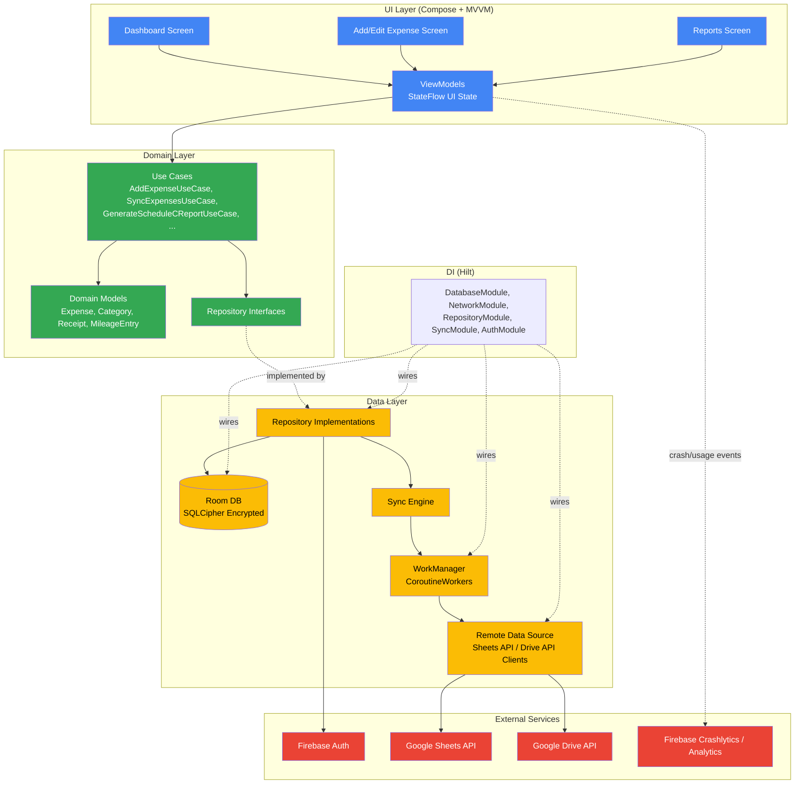
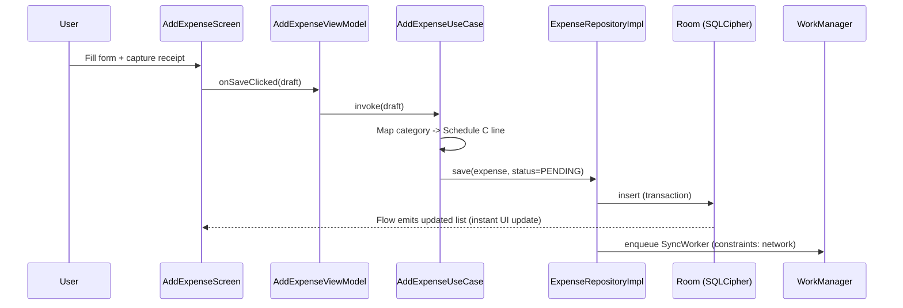
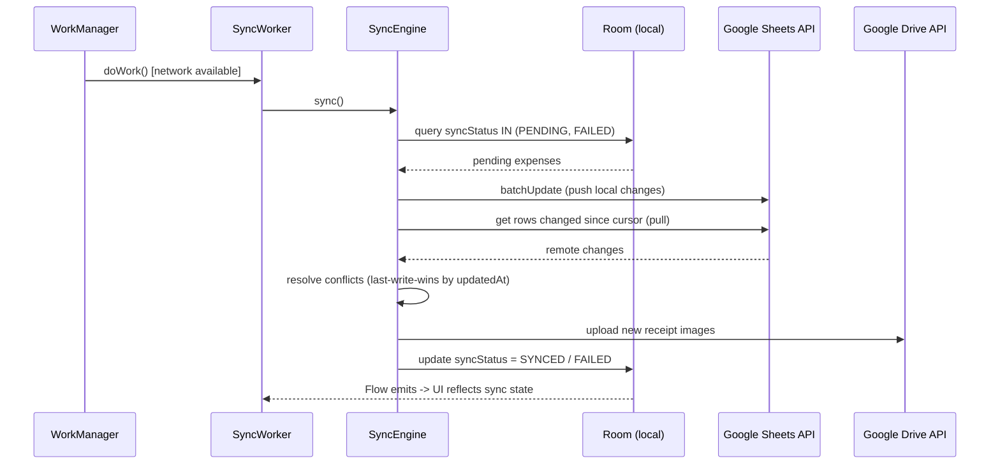

# Architecture

This document describes Ledgerly's architecture in depth: layer responsibilities, data flow through the system, the offline-first sync strategy, threading model, dependency injection graph, and how the app is designed to absorb future features without major refactors.

## Table of Contents

- [Guiding Principles](#guiding-principles)
- [Layers](#layers)
- [The Dependency Rule](#the-dependency-rule)
- [Component Diagram](#component-diagram)
- [Data Flow: Add Expense](#data-flow-add-expense)
- [Data Flow: Background Sync](#data-flow-background-sync)
- [Offline-First Sync Strategy](#offline-first-sync-strategy)
- [Threading & Coroutines](#threading--coroutines)
- [Dependency Injection Graph](#dependency-injection-graph)
- [Extensibility: Future Features](#extensibility-future-features)
- [Testing Strategy](#testing-strategy)

## Guiding Principles

Ledgerly is built on **Clean Architecture** combined with **MVVM** on the UI layer:

- **Separation of concerns**: business rules are independent of UI framework and persistence/sync technology choices.
- **Testability**: domain logic (use cases) has zero Android framework dependencies and can be unit tested on the JVM in milliseconds.
- **Offline-first**: the local encrypted Room database is the single source of truth for the UI. The network (Google Sheets/Drive) is a sync target, never a blocking dependency for reads or writes.
- **Unidirectional data flow**: UI state flows down from ViewModels via `StateFlow`; user intent flows up via events/function calls.

## Layers

### `domain`

The innermost layer. Pure Kotlin, no Android SDK or third-party framework dependencies (aside from coroutines).

- **`model`** — Plain data classes representing core business concepts: `Expense`, `Category`, `Receipt`, `MileageEntry`, `RecurringExpenseRule`, `TaxReport`, etc.
- **`repository`** — Interfaces only (e.g., `ExpenseRepository`, `CategoryRepository`, `SyncRepository`). These define the contract the data layer must fulfill, owned by the domain layer per the Dependency Inversion Principle.
- **`usecase`** — Single-responsibility business operations, e.g. `AddExpenseUseCase`, `GetExpensesForDateRangeUseCase`, `GenerateScheduleCReportUseCase`, `CalculateMileageDeductionUseCase`, `SyncExpensesUseCase`. Use cases orchestrate one or more repositories and contain the actual business rules (e.g., Schedule C category mapping logic, recurring expense expansion).

### `data`

Implements the domain's repository interfaces and owns all I/O.

- **`local`** — Room database, DAOs, `@Entity` classes, type converters, and the SQLCipher `SupportFactory` configuration that encrypts the database file at rest. The passphrase is derived from a key sealed in the Android Keystore (via AndroidX Security), never hardcoded.
- **`remote`** — Retrofit services and the Google API Client wrappers for the Sheets API and Drive API; Firebase Auth bindings.
- **`repository`** — Concrete `ExpenseRepositoryImpl`, etc. These classes mediate between `local` and `remote`, implement the offline-first read/write strategy, and map between Room entities and domain models.
- **`sync`** — WorkManager `CoroutineWorker` implementations and the sync engine that reconciles local pending changes with the remote Google Sheet, including conflict resolution.
- **`mapper`** — Pure functions converting between Room entities, network DTOs, and domain models, keeping persistence/network shapes out of the domain layer.

### `ui`

Jetpack Compose screens organized by feature (`dashboard`, `expense`, `reports`, `mileage`, `settings`, `auth`), each paired with a `ViewModel` (Hilt `@HiltViewModel`) that:

- Exposes UI state as `StateFlow<UiState>` (typically a sealed class: `Loading`, `Success`, `Error`, or a single immutable state data class).
- Calls domain use cases — never repositories or data sources directly.
- Contains no business logic beyond simple presentation mapping (formatting currency, dates, etc.).

`navigation` holds the Compose Navigation graph; `common` holds shared composables (buttons, cards, the app's Material 3 theme).

### `di`

Hilt modules that bind interfaces to implementations and provide singletons: `DatabaseModule` (Room + SQLCipher), `NetworkModule` (Retrofit, Google API clients), `RepositoryModule`, `SyncModule` (WorkManager configuration), and `AuthModule` (Firebase Auth).

## The Dependency Rule

Source code dependencies point **inward only**:

```
ui  ──depends on──>  domain  <──depends on──  data
                        ▲
                        │
                  (interfaces live here;
                   data provides implementations)
```

- `domain` has no knowledge of `ui` or `data`. It cannot import Room, Retrofit, Compose, or any Android framework class.
- `data` depends on `domain` (to implement its repository interfaces and use its models) but never on `ui`.
- `ui` depends on `domain` (use cases, models) but never directly on `data` (no DAO or Retrofit service is ever referenced from a ViewModel or Composable).
- `di` is the only layer permitted to know about all three, since its job is wiring concrete implementations to interfaces at the composition root.

This means the persistence technology (Room/SQLCipher) or the sync backend (Google Sheets) could be swapped without touching a single use case or Composable — only the `data` layer implementation and its `di` bindings would change.

## Component Diagram



## Data Flow: Add Expense

End-to-end path when a user captures a receipt and saves a new expense:

1. **UI**: User fills out the Add Expense form in `ui/expense/AddExpenseScreen.kt` and optionally captures a photo via CameraX, which writes a local image file and returns its URI.
2. **ViewModel**: `AddExpenseViewModel` validates form input (amount, date, category) at the presentation level and calls `AddExpenseUseCase.invoke(expenseDraft)` on a coroutine scoped to `viewModelScope`.
3. **Use Case**: `AddExpenseUseCase` (domain layer) applies business rules — e.g., resolving the Schedule C category mapping for the chosen category, validating the receipt is attached if the category requires substantiation — and constructs a domain `Expense` with `syncStatus = PENDING` and `updatedAt = now()`.
4. **Repository**: `ExpenseRepositoryImpl.save(expense)` persists the `Expense` (mapped to a Room entity) into the encrypted local database in a single transaction, including the receipt image reference.
5. **Immediate UI update**: Because Room DAOs expose `Flow<List<ExpenseEntity>>`, the dashboard and expense list screens — which are already collecting that Flow via their ViewModels — update instantly and optimistically. The user sees the new expense immediately, with no network round-trip on the critical path.
6. **Sync trigger**: Saving a `PENDING` expense enqueues a `OneTimeWorkRequest` (via `SyncRepository.scheduleSync()`) with an existing-work policy of `KEEP` or `REPLACE` and a network-connected constraint, debounced/batched so rapid successive entries don't each trigger a separate sync job.
7. **Background sync** then proceeds as described below, eventually flipping `syncStatus` to `SYNCED` (or `FAILED`), which flows back to the UI the same way — through Room's reactive `Flow`.



## Data Flow: Background Sync

1. **Trigger**: A `SyncWorker` (CoroutineWorker) runs — either enqueued immediately after a local write, on WorkManager's periodic schedule (e.g., every 15–30 minutes as a safety net), or triggered manually from Settings ("Sync now").
2. **Constraint check**: WorkManager only runs the job when its constraints are satisfied (network connected; optionally battery-not-low), and retries with exponential backoff on failure.
3. **Authentication**: The worker obtains a valid Google OAuth access token (refreshing via Firebase Auth / Google Sign-In silent sign-in if expired).
4. **Pull pending changes**: `SyncEngine` queries Room for all entities where `syncStatus = PENDING` or `FAILED` (eligible for retry), plus a remote change cursor/timestamp for the linked spreadsheet.
5. **Push local changes**: For each pending expense, the engine upserts a corresponding row into the user's Google Sheet via the Sheets API (batched using `batchUpdate` to minimize API calls and stay under quota).
6. **Pull remote changes**: The engine reads remote rows modified since the last successful sync (tracked via a stored sync cursor/timestamp) to detect edits made directly in Google Sheets.
7. **Conflict resolution**: Where a row was modified both locally and remotely since the last sync, resolve per the strategy below.
8. **Write-back**: Update each local entity's `syncStatus` to `SYNCED` on success (storing the remote row reference) or `FAILED` (with an error reason surfaced in Settings/Sync status UI) on failure; failures remain `PENDING`/`FAILED` and are retried on the next sync pass.
9. **Receipts**: Receipt images attached to synced expenses are uploaded to a per-user Google Drive folder (`drive.file` scope) and linked from the corresponding Sheet row, decoupling large binary uploads from the lightweight Sheets row sync.



## Offline-First Sync Strategy

Room is the **single source of truth** for everything the UI renders. The Google Sheet is a synchronized projection of that data, not the authority the app reads from at runtime. This makes every screen fully functional with zero connectivity.

### Sync status model

Each syncable entity (`Expense`, `MileageEntry`, etc.) carries:

```kotlin
enum class SyncStatus { PENDING, SYNCED, FAILED }
```

- **`PENDING`** — created or modified locally and not yet confirmed synced.
- **`SYNCED`** — confirmed identical to the remote Google Sheet as of the last successful sync.
- **`FAILED`** — the last sync attempt for this record errored (e.g., quota exceeded, auth expired, malformed remote edit); retried on the next sync pass with backoff.

Every syncable entity also carries an `updatedAt: Instant` timestamp, updated on every local mutation.

### Conflict resolution: last-write-wins by `updatedAt`

When the same logical record has diverged both locally (`PENDING`) and remotely (changed in the Google Sheet) since the last successful sync:

1. Compare the local `updatedAt` against the remote row's last-modified signal (the Sheets API doesn't provide native per-row timestamps, so Ledgerly maintains a shadow "last synced" timestamp/checksum column in a hidden sheet/metadata range to detect remote-side edits).
2. **The side with the later `updatedAt` wins** and overwrites the other.
3. The losing side's data is not silently discarded for destructive changes — the engine logs the conflict and, for material differences (e.g., amount changed), surfaces a non-blocking "resolved automatically" entry in the sync log accessible from Settings, so users can audit what happened.
4. After resolution, both local Room and the remote Sheet converge to the same value, and the winning side's record is marked `SYNCED`.

This strategy is intentionally simple (no CRDTs, no manual merge UI) because expense records are small, mostly append-only, and conflicts are rare in practice (a user is unlikely to edit the same expense in the app and in the spreadsheet within the same sync window). It favors predictability and low implementation complexity over perfect merge semantics.

### Deletions

Deletes are soft (a `deletedAt` / `isDeleted` flag plus `syncStatus = PENDING`) until propagated to the remote sheet, then hard-removed locally, avoiding "zombie" rows reappearing from a stale remote pull mid-sync.

## Threading & Coroutines

- **Structured concurrency** throughout: ViewModels launch work in `viewModelScope`; repositories expose `suspend` functions and `Flow`; WorkManager workers use `CoroutineWorker` with `withContext(Dispatchers.IO)` for blocking calls.
- **Room** queries return `Flow` for observed data (lists, dashboards) and `suspend fun` for one-shot reads/writes; Room dispatches these on its own query executor, kept off the main thread automatically.
- **Network calls** (Retrofit/Google API client) run on `Dispatchers.IO`.
- **CameraX** image capture callbacks are bridged into coroutines via `suspendCancellableCoroutine` where the API is callback-based.
- **WorkManager** workers run on a background executor by default; `CoroutineWorker.doWork()` is itself a suspend function, so sync logic composes naturally with the same repository/use-case suspend functions the UI layer uses — no duplicated business logic between "live" and "background" code paths.
- **Hilt** provides a qualified `@IoDispatcher` / `@DefaultDispatcher` `CoroutineDispatcher` bindings so dispatchers are injectable and swappable with `TestDispatcher` in tests, rather than hardcoding `Dispatchers.IO` throughout the codebase.

## Dependency Injection Graph

Hilt wires the app via `@Module @InstallIn(SingletonComponent::class)` modules in `di/`:

| Module | Provides | Scope |
|---|---|---|
| `DatabaseModule` | `LedgerlyDatabase` (Room + SQLCipher `SupportFactory`), DAOs | Singleton |
| `NetworkModule` | Retrofit instance, OkHttp client, Sheets/Drive API service clients | Singleton |
| `RepositoryModule` | Binds `ExpenseRepository -> ExpenseRepositoryImpl`, etc. (`@Binds`) | Singleton |
| `SyncModule` | `HiltWorkerFactory` configuration, WorkManager constraints/policies | Singleton |
| `AuthModule` | `FirebaseAuth`, `GoogleSignInClient`, credential/session management | Singleton |
| `DispatcherModule` | Qualified `CoroutineDispatcher`s (`@IoDispatcher`, etc.) | Singleton |

`LedgerlyApplication` implements `Configuration.Provider` to supply the `HiltWorkerFactory` to WorkManager, so workers themselves participate in the same DI graph as the rest of the app (i.e., a `SyncWorker` can `@AssistedInject` the same repositories a ViewModel uses).

ViewModels are provided via `@HiltViewModel` + `hiltViewModel()` in Compose navigation destinations, scoped to their navigation back stack entry.

## Extensibility: Future Features

The architecture is deliberately shaped so the roadmap items slot in as new implementations behind existing seams, not as cross-cutting rewrites:

- **OCR receipt extraction**: A new `data/ocr` source (e.g., ML Kit Text Recognition) implementing a new `ReceiptOcrRepository` interface in `domain`. `AddExpenseUseCase` gains an optional pre-fill step that calls a new `ExtractReceiptDataUseCase` — the persistence, sync, and UI state model are untouched.
- **AI-assisted categorization**: A new `CategorizationSuggestionUseCase` that calls a remote inference endpoint or on-device model, returning a suggested `Category`. It plugs into the existing Add Expense flow as a suggestion the user confirms — no schema change beyond an optional `suggestedCategoryId` field.
- **Bank/credit card import**: A new `data/remote/bank` source (e.g., an aggregator API) implementing a `TransactionImportRepository`. Imported transactions are mapped to the same domain `Expense` model and flow through the identical `syncStatus`/Room/WorkManager pipeline as manually entered expenses — sync and conflict resolution logic is fully reused.
- **Multi-business support**: Introduces a `Business` domain model and a `businessId` foreign key on `Expense`, `MileageEntry`, etc. Because repositories already mediate all data access through use cases rather than the UI querying Room directly, scoping queries by `businessId` is a `data`-layer and `domain`-layer change; most Compose screens only need a business-selector added to their existing state, not a rewrite.

In each case, the **Dependency Rule holds**: new capabilities are added as new `data` implementations behind `domain` interfaces, or as new use cases — the `ui` layer only ever talks to `domain`, so it remains stable as the data/integration surface grows.

## Testing Strategy

Testing mirrors the layered architecture, maximizing fast, deterministic JVM tests and reserving instrumented tests for what truly requires a device.

| Layer | Test Type | Tools | What's Verified |
|---|---|---|---|
| `domain` (use cases, models) | Unit tests (JVM) | JUnit, MockK, Turbine, kotlinx-coroutines-test | Business rules in isolation — Schedule C mapping, recurring expense expansion, mileage deduction math, conflict resolution logic — with repository interfaces mocked. |
| `data/repository`, `data/sync` | Unit tests (JVM) | JUnit, MockK, Robolectric (where Android classes are unavoidable), an in-memory Room database | Repository implementations against an in-memory Room DB and faked remote clients; sync engine conflict resolution against constructed local/remote divergence scenarios. |
| `data/local` (DAOs, migrations) | Instrumented tests | AndroidX Test, Room's `MigrationTestHelper` | DAO query correctness and that every Room schema migration runs cleanly against a prior-version database. |
| `ui` (ViewModels) | Unit tests (JVM) | JUnit, MockK, Turbine, `kotlinx-coroutines-test` | ViewModel state transitions given fake/mocked use cases — no Compose or Android framework needed since ViewModels expose plain `StateFlow`. |
| `ui` (Composables) | Instrumented / Compose UI tests | Compose UI Test, Espresso | Screen rendering, navigation, and interaction flows on a device/emulator. |
| End-to-end sync | Instrumented tests | AndroidX Test + WorkManager `TestDriver`/`WorkManagerTestInitHelper` | Worker constraints trigger correctly and `SyncWorker` produces the expected `syncStatus` transitions against a fake Sheets/Drive client. |

General principles:

- Favor **fakes over mocks** for repository interfaces in use case tests (a lightweight in-memory `FakeExpenseRepository`) to keep tests resilient to refactors.
- Domain logic — especially Schedule C category mapping and conflict resolution — is held to high coverage since it's the part of the app users depend on for tax accuracy.
- CI runs `./gradlew test` on every push/PR; `./gradlew connectedAndroidTest` runs against a managed emulator (e.g., Gradle Managed Devices) on a slower CI lane or pre-release gate, given its cost relative to unit tests.
