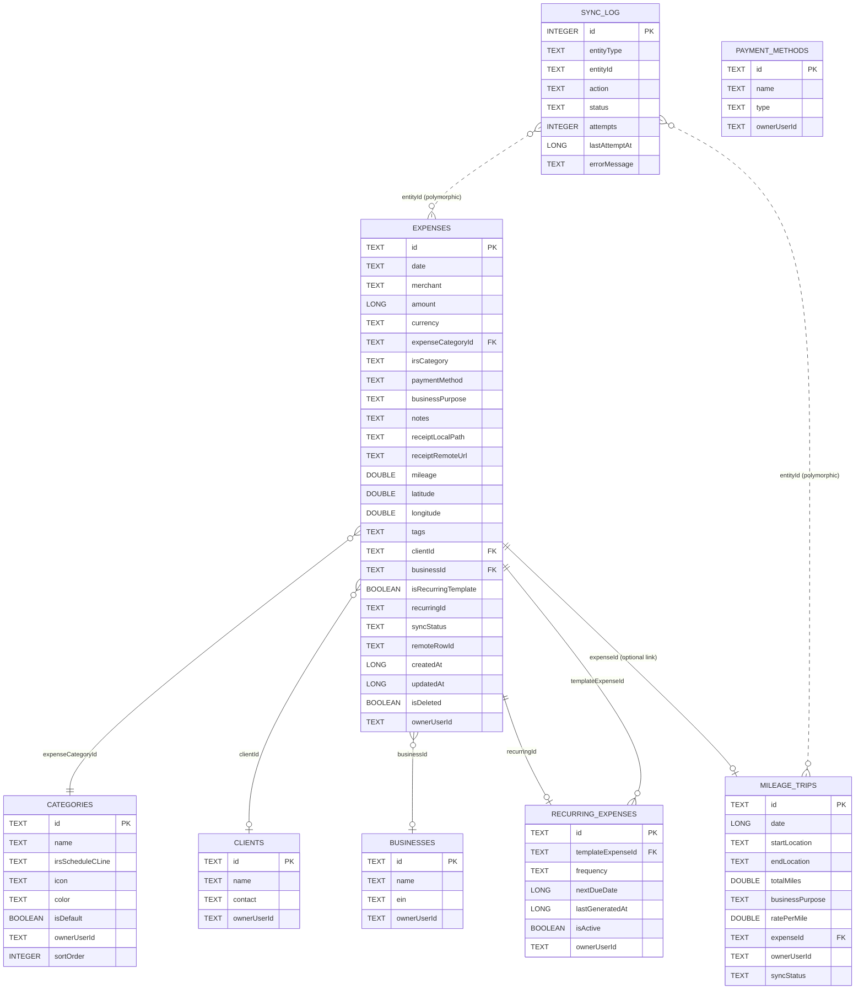

# Database Schema

Ledgerly's local persistence layer is a [Room](https://developer.android.com/training/data-storage/room) database backed by [SQLCipher](https://www.zetetic.net/sqlcipher/) for at-rest encryption. The database is the source of truth for offline-first operation; the Google Sheet ([`GOOGLE_SHEETS_SETUP.md`](GOOGLE_SHEETS_SETUP.md)) and Drive receipts ([`GOOGLE_DRIVE_SETUP.md`](GOOGLE_DRIVE_SETUP.md)) are sync targets derived from this data, not alternate sources of truth.

## Contents

- [Conventions](#conventions)
- [ER overview](#er-overview)
- [Tables](#tables)
  - [expenses](#expenses)
  - [categories](#categories)
  - [clients](#clients)
  - [businesses](#businesses)
  - [payment_methods](#payment_methods)
  - [recurring_expenses](#recurring_expenses)
  - [mileage_trips](#mileage_trips)
  - [sync_log](#sync_log)
- [IRS Schedule C category mapping](#irs-schedule-c-category-mapping)
- [Migration strategy](#migration-strategy)
- [Encryption (SQLCipher)](#encryption-sqlcipher)
- [Multi-user isolation](#multi-user-isolation)

## Conventions

- All primary keys are `TEXT` (UUID v4 strings), generated client-side at creation time, **except** `sync_log.id`, which is an autoincrementing `INTEGER` local-only log id. Client-generated UUIDs let rows be created fully offline and later sync to the Google Sheet's `Transaction ID` column without ever needing a server-assigned ID.
- All monetary amounts are stored as `Long` integer **cents** (e.g. `$42.50` → `4250`), never `Float`/`Double`, to avoid floating-point rounding errors in financial data. Conversion to decimal currency happens only at the presentation layer and when writing the `Amount` column to the Google Sheet.
- All timestamps (`createdAt`, `updatedAt`, `lastAttemptAt`, `nextDueDate`, `lastGeneratedAt`) are stored as `Long` epoch milliseconds (UTC).
- Every table that holds user-owned data carries an `ownerUserId TEXT NOT NULL` column. See [Multi-user isolation](#multi-user-isolation).
- Boolean columns are stored as `Boolean` in the Room entity (mapped to `INTEGER` 0/1 by Room/SQLite, as usual).
- Foreign keys use `ON DELETE` behavior chosen per relationship (noted per table); Room enforces these via `@ForeignKey` with `androidx.room.ForeignKey` constraints, and `PRAGMA foreign_keys = ON` is enabled in the `RoomDatabase.Callback`.

## ER overview



Notes on the diagram:
- `expenses.expenseCategoryId → categories.id` is the only **mandatory** foreign key on `expenses`; `clientId`, `businessId`, and `recurringId` are nullable, optional associations.
- `mileage_trips.expenseId` is an optional link back to an `expenses` row when a trip is folded into a broader expense record (e.g. a combined "client visit" expense with both a receipt and mileage); a standalone mileage trip leaves this `NULL` and syncs to the Sheet as its own row (see [`GOOGLE_SHEETS_SETUP.md` Section 8](GOOGLE_SHEETS_SETUP.md#8-how-rows-map-to-expenses)).
- `sync_log` is intentionally polymorphic (`entityType` + `entityId`, not a typed FK) since it logs sync attempts across multiple entity tables (`expenses`, `mileage_trips`, and potentially future syncable entities) without needing a table per entity type.

## Tables

### expenses

The core transactional table — one row per business expense.

| Column | Type | Constraints | Notes |
|---|---|---|---|
| `id` | `TEXT` | **PK** | UUID v4, client-generated. Maps 1:1 to the Sheet's `Transaction ID` column. |
| `date` | `TEXT` | NOT NULL | ISO-8601 date (`yyyy-MM-dd`) of the expense transaction (not entry date). Stored as `TEXT` rather than epoch millis so date-only semantics (no timezone/time-of-day ambiguity) are preserved; indexed for range queries. |
| `merchant` | `TEXT` | NOT NULL | Vendor/payee name. |
| `amount` | `LONG` | NOT NULL | Integer cents. See [Conventions](#conventions). |
| `currency` | `TEXT` | NOT NULL, default `"USD"` | ISO 4217 currency code. Schedule C is a USD form; non-USD entries are informational/converted at report time in a future multi-currency release (see README roadmap). |
| `expenseCategoryId` | `TEXT` | **FK** → `categories.id`, NOT NULL | `ON DELETE RESTRICT` — a category in use cannot be deleted (UI should guide users to reassign expenses first, or soft-hide the category instead of deleting). |
| `irsCategory` | `TEXT` | NOT NULL | Denormalized snapshot of the mapped Schedule C line *at the time the expense was recorded* (e.g. `"Line 18 - Office expense"`). Denormalized deliberately: if a user later edits a category's IRS mapping, prior-year expenses must retain the line they were originally filed under for audit consistency, rather than silently reclassifying historical data. |
| `paymentMethod` | `TEXT` | NOT NULL | Free-text snapshot of the payment method name at entry time (not a strict FK to `payment_methods.id`, for the same historical-snapshot reasoning as `irsCategory`). |
| `businessPurpose` | `TEXT` | nullable | Free-text justification (e.g. "Client lunch — Acme Corp project kickoff"), important for IRS substantiation of deductibility. |
| `notes` | `TEXT` | nullable | Free-text. |
| `receiptLocalPath` | `TEXT` | nullable | Filesystem path (app-private storage) to the locally cached receipt image. |
| `receiptRemoteUrl` | `TEXT` | nullable | Drive `webViewLink` once uploaded. See [`GOOGLE_DRIVE_SETUP.md`](GOOGLE_DRIVE_SETUP.md#5-getting-shareable-links). |
| `mileage` | `DOUBLE` | nullable | Miles, when this expense itself represents a mileage-based deduction not tracked as a separate `mileage_trips` row. |
| `latitude` | `DOUBLE` | nullable | Captured location, if location tagging is enabled. |
| `longitude` | `DOUBLE` | nullable | Captured location, if location tagging is enabled. |
| `tags` | `TEXT` | nullable | Comma-separated free-form tags (denormalized; simple and sufficient at this scale rather than a join table). |
| `clientId` | `TEXT` | **FK** → `clients.id`, nullable | `ON DELETE SET NULL`. |
| `businessId` | `TEXT` | **FK** → `businesses.id`, nullable | `ON DELETE SET NULL`. |
| `isRecurringTemplate` | `BOOLEAN` | NOT NULL, default `false` | `true` if this row is the template definition referenced by a `recurring_expenses.templateExpenseId`, rather than a generated instance. |
| `recurringId` | `TEXT` | nullable, logical FK → `recurring_expenses.id` | Set on generated instances to trace them back to the recurring rule that created them. Not declared as a strict Room `@ForeignKey` to avoid a circular FK cycle with `recurring_expenses.templateExpenseId`; integrity is maintained at the repository/use-case layer. |
| `syncStatus` | `TEXT` (enum) | NOT NULL, default `"PENDING"` | One of `PENDING`, `SYNCED`, `FAILED`. Drives the Sheets sync worker's queue. See [`GOOGLE_SHEETS_SETUP.md` Section 8](GOOGLE_SHEETS_SETUP.md#8-how-rows-map-to-expenses). |
| `remoteRowId` | `TEXT` | nullable | 1-indexed Google Sheet row number this expense last synced to, used to target `UPDATE` range writes without a full-sheet column scan. Cleared/re-resolved if structure drift is detected. |
| `createdAt` | `LONG` | NOT NULL | Epoch millis, set once on insert. |
| `updatedAt` | `LONG` | NOT NULL | Epoch millis, updated on every local mutation; also the basis for the Sheet's `Updated Timestamp` column. |
| `isDeleted` | `BOOLEAN` | NOT NULL, default `false` | Soft delete. Deleted expenses are filtered from all standard queries and the UI but retained for sync consistency and potential recovery; see [`GOOGLE_SHEETS_SETUP.md` Section 8](GOOGLE_SHEETS_SETUP.md#8-how-rows-map-to-expenses) for how soft-deletes interact with the Sheet. |
| `ownerUserId` | `TEXT` | NOT NULL | Firebase Auth UID of the owning user (or guest/anonymous UID). See [Multi-user isolation](#multi-user-isolation). |

**Indices:**
```sql
CREATE INDEX index_expenses_ownerUserId ON expenses(ownerUserId);
CREATE INDEX index_expenses_date ON expenses(date);
CREATE INDEX index_expenses_expenseCategoryId ON expenses(expenseCategoryId);
CREATE INDEX index_expenses_syncStatus ON expenses(syncStatus);
CREATE INDEX index_expenses_clientId ON expenses(clientId);
CREATE INDEX index_expenses_businessId ON expenses(businessId);
CREATE INDEX index_expenses_isDeleted ON expenses(isDeleted);
-- Composite index for the most common dashboard/report query shape:
CREATE INDEX index_expenses_owner_date_deleted ON expenses(ownerUserId, date, isDeleted);
```

### categories

User-visible expense categories, each optionally mapped to an IRS Schedule C line. Seeded with defaults per user (`isDefault = true`) on first launch; users can add custom categories.

| Column | Type | Constraints | Notes |
|---|---|---|---|
| `id` | `TEXT` | **PK** | UUID v4. |
| `name` | `TEXT` | NOT NULL | e.g. `"Software"`, `"Office Supplies"`. |
| `irsScheduleCLine` | `TEXT` | nullable | The current Schedule C line mapping for this category. See [IRS Schedule C category mapping](#irs-schedule-c-category-mapping). Nullable because user-created custom categories may be left uncategorized for tax purposes until the user assigns one. |
| `icon` | `TEXT` | nullable | Icon identifier/resource key for UI display. |
| `color` | `TEXT` | nullable | Hex color string for UI theming (charts, category chips). |
| `isDefault` | `BOOLEAN` | NOT NULL, default `false` | `true` for the built-in seeded categories (see mapping table below); `false` for user-created custom categories. Default categories can be hidden but not deleted, to preserve referential integrity with historical `irsCategory` snapshots. |
| `ownerUserId` | `TEXT` | NOT NULL | See [Multi-user isolation](#multi-user-isolation). Default categories are seeded per-user (not shared globally) so each user can independently customize/reorder/hide them. |
| `sortOrder` | `INTEGER` | NOT NULL, default `0` | User-controlled display order. |

**Indices:**
```sql
CREATE INDEX index_categories_ownerUserId ON categories(ownerUserId);
CREATE UNIQUE INDEX index_categories_owner_name ON categories(ownerUserId, name);
```

### clients

Optional client/customer association for an expense (useful for billing-back or per-client expense reporting).

| Column | Type | Constraints | Notes |
|---|---|---|---|
| `id` | `TEXT` | **PK** | UUID v4. |
| `name` | `TEXT` | NOT NULL | |
| `contact` | `TEXT` | nullable | Free-text contact info (email/phone), kept simple rather than a structured contact table. |
| `ownerUserId` | `TEXT` | NOT NULL | See [Multi-user isolation](#multi-user-isolation). |

**Indices:**
```sql
CREATE INDEX index_clients_ownerUserId ON clients(ownerUserId);
```

### businesses

Supports users who file Schedule C for more than one business/entity (see README roadmap: multi-business support).

| Column | Type | Constraints | Notes |
|---|---|---|---|
| `id` | `TEXT` | **PK** | UUID v4. |
| `name` | `TEXT` | NOT NULL | |
| `ein` | `TEXT` | nullable | Employer Identification Number, if the business has one (sole proprietors filing Schedule C often use their SSN instead and leave this blank). Treated as sensitive — see [Encryption (SQLCipher)](#encryption-sqlcipher). |
| `ownerUserId` | `TEXT` | NOT NULL | See [Multi-user isolation](#multi-user-isolation). |

**Indices:**
```sql
CREATE INDEX index_businesses_ownerUserId ON businesses(ownerUserId);
```

### payment_methods

User-managed list of payment methods (cards, accounts) offered as quick-select options on expense entry.

| Column | Type | Constraints | Notes |
|---|---|---|---|
| `id` | `TEXT` | **PK** | UUID v4. |
| `name` | `TEXT` | NOT NULL | e.g. `"Business Visa ...4321"`, `"Cash"`. Stores only a user-chosen label, never a full card number. |
| `type` | `TEXT` | NOT NULL | Free-text/enum-like category, e.g. `"CREDIT_CARD"`, `"DEBIT_CARD"`, `"CASH"`, `"BANK_TRANSFER"`, `"CHECK"`, `"OTHER"`. |
| `ownerUserId` | `TEXT` | NOT NULL | See [Multi-user isolation](#multi-user-isolation). |

**Indices:**
```sql
CREATE INDEX index_payment_methods_ownerUserId ON payment_methods(ownerUserId);
```

### recurring_expenses

Defines a recurrence rule for a template expense (e.g. a monthly software subscription), which the app uses to auto-generate new `expenses` rows on schedule.

| Column | Type | Constraints | Notes |
|---|---|---|---|
| `id` | `TEXT` | **PK** | UUID v4. |
| `templateExpenseId` | `TEXT` | **FK** → `expenses.id`, NOT NULL | The `expenses` row with `isRecurringTemplate = true` that this rule generates instances from. `ON DELETE CASCADE` — deleting the template removes the recurrence rule. |
| `frequency` | `TEXT` (enum) | NOT NULL | One of `DAILY`, `WEEKLY`, `BIWEEKLY`, `MONTHLY`, `QUARTERLY`, `ANNUALLY`. |
| `nextDueDate` | `LONG` | NOT NULL | Epoch millis; a WorkManager periodic worker checks due recurrences and generates the next `expenses` instance. |
| `lastGeneratedAt` | `LONG` | nullable | Epoch millis of the last successful auto-generation; `NULL` if none has run yet. |
| `isActive` | `BOOLEAN` | NOT NULL, default `true` | Paused recurrences (`false`) are skipped by the generation worker without deleting the rule. |
| `ownerUserId` | `TEXT` | NOT NULL | See [Multi-user isolation](#multi-user-isolation). |

**Indices:**
```sql
CREATE INDEX index_recurring_expenses_ownerUserId ON recurring_expenses(ownerUserId);
CREATE INDEX index_recurring_expenses_templateExpenseId ON recurring_expenses(templateExpenseId);
CREATE INDEX index_recurring_expenses_nextDueDate_isActive ON recurring_expenses(nextDueDate, isActive);
```

### mileage_trips

Standalone vehicle-mileage deduction records (IRS standard mileage rate method), optionally linked to a broader expense.

| Column | Type | Constraints | Notes |
|---|---|---|---|
| `id` | `TEXT` | **PK** | UUID v4. |
| `date` | `LONG` | NOT NULL | Epoch millis of the trip date. |
| `startLocation` | `TEXT` | NOT NULL | Free-text or geocoded address. |
| `endLocation` | `TEXT` | NOT NULL | Free-text or geocoded address. |
| `totalMiles` | `DOUBLE` | NOT NULL | Trip distance in miles. |
| `businessPurpose` | `TEXT` | NOT NULL | Required for IRS substantiation of a mileage deduction. |
| `ratePerMile` | `DOUBLE` | NOT NULL | IRS standard mileage rate (cents/mile) in effect for the trip's tax year, snapshotted at entry time so historical trips remain correct even after the IRS publishes a new annual rate. |
| `expenseId` | `TEXT` | **FK** → `expenses.id`, nullable | `ON DELETE SET NULL`. Set when the trip is folded into a combined expense record; `NULL` for a standalone mileage entry. |
| `ownerUserId` | `TEXT` | NOT NULL | See [Multi-user isolation](#multi-user-isolation). |
| `syncStatus` | `TEXT` (enum) | NOT NULL, default `"PENDING"` | Same `PENDING`/`SYNCED`/`FAILED` semantics as `expenses.syncStatus`; standalone trips sync to their own Sheet row (see [`GOOGLE_SHEETS_SETUP.md` Section 8](GOOGLE_SHEETS_SETUP.md#8-how-rows-map-to-expenses)). |

**Indices:**
```sql
CREATE INDEX index_mileage_trips_ownerUserId ON mileage_trips(ownerUserId);
CREATE INDEX index_mileage_trips_date ON mileage_trips(date);
CREATE INDEX index_mileage_trips_expenseId ON mileage_trips(expenseId);
CREATE INDEX index_mileage_trips_syncStatus ON mileage_trips(syncStatus);
```

### sync_log

Append-mostly audit log of sync attempts across syncable entities (currently `expenses` and `mileage_trips`, and Drive receipt uploads). Used for diagnostics, a "sync history" debug screen, and to drive retry/backoff bookkeeping beyond what WorkManager's own state tracks.

| Column | Type | Constraints | Notes |
|---|---|---|---|
| `id` | `INTEGER` | **PK**, `AUTOINCREMENT` | Local-only surrogate key; this table never syncs anywhere itself. |
| `entityType` | `TEXT` (enum) | NOT NULL | One of `EXPENSE`, `MILEAGE_TRIP`, `RECEIPT_UPLOAD`. Polymorphic discriminator for `entityId`. |
| `entityId` | `TEXT` | NOT NULL | The `id` of the referenced `expenses` / `mileage_trips` row (no strict FK — see [ER overview](#er-overview) notes on why this is intentionally polymorphic). |
| `action` | `TEXT` (enum) | NOT NULL | One of `CREATE_ROW`, `UPDATE_ROW`, `UPLOAD_RECEIPT`, `DELETE_ROW`. |
| `status` | `TEXT` (enum) | NOT NULL | One of `SUCCESS`, `FAILED`, `IN_PROGRESS`. |
| `attempts` | `INTEGER` | NOT NULL, default `0` | Incremented on each retry; informs UI messaging like "failed after 3 attempts." |
| `lastAttemptAt` | `LONG` | NOT NULL | Epoch millis. |
| `errorMessage` | `TEXT` | nullable | Captured exception message/HTTP error body for the most recent failed attempt, surfaced in a sync diagnostics screen. |

**Indices:**
```sql
CREATE INDEX index_sync_log_entityType_entityId ON sync_log(entityType, entityId);
CREATE INDEX index_sync_log_status ON sync_log(status);
CREATE INDEX index_sync_log_lastAttemptAt ON sync_log(lastAttemptAt);
```

`sync_log` deliberately has **no** `ownerUserId` column of its own in the base schema; it is always queried joined/filtered through its referenced entity's `ownerUserId` (via `entityId`) rather than duplicating ownership data. (If a direct per-row owner filter is later needed for performance, an `ownerUserId` column can be added in a future migration — see [Migration strategy](#migration-strategy).)

## IRS Schedule C category mapping

Default categories are seeded per-user and pre-mapped to Schedule C, Part II expense lines (current as of the 2025 revision of Form 1040 Schedule C). Users can remap or add custom categories; `expenses.irsCategory` snapshots the mapping at the time of entry (see [`expenses`](#expenses) table notes).

| Default category (`categories.name`) | Schedule C line | Line description |
|---|---|---|
| Advertising | Line 8 | Advertising |
| Vehicle Expenses / Mileage | Line 9 | Car and truck expenses (see [`mileage_trips`](#mileage_trips)) |
| Contract Labor | Line 11 | Contract labor |
| Business Insurance | Line 15 | Insurance (other than health) |
| Loan Interest | Line 16a | Interest — mortgage (paid to banks, etc.) |
| Other Interest | Line 16b | Interest — other |
| Legal & Professional Services | Line 17 | Legal and professional services |
| Office Supplies | Line 18 | Office expense |
| Rent — Equipment | Line 20a | Rent or lease — vehicles, machinery, equipment |
| Rent — Office/Property | Line 20b | Rent or lease — other business property |
| Repairs & Maintenance | Line 21 | Repairs and maintenance |
| Supplies | Line 22 | Supplies (not included in Part III — Cost of Goods Sold) |
| Business Taxes & Licenses | Line 23 | Taxes and licenses |
| Travel | Line 24a | Travel |
| Meals (Business) | Line 24b | Deductible meals (subject to the 50% limit) |
| Utilities | Line 25 | Utilities |
| Wages | Line 26 | Wages (less employment credits) |
| Software | Line 27a | Other expenses (itemized on Part V) — "Software/SaaS subscriptions" |
| Education & Training | Line 27a | Other expenses (itemized on Part V) — "Professional development" |
| Bank & Merchant Fees | Line 27a | Other expenses (itemized on Part V) — "Bank/merchant processing fees" |
| Dues & Subscriptions | Line 27a | Other expenses (itemized on Part V) — "Dues and subscriptions" |
| Home Office | Form 8829 | Expenses for Business Use of Your Home (flows to Schedule C Line 30, not entered directly on Part II) |
| Uncategorized | — | Not mapped; excluded from the Schedule C export summary until the user assigns a category |

Notes:
- Line 27a ("Other expenses") on the printed Schedule C form is a single total backed by an itemized list on **Part V** of the form; Ledgerly's report generator groups all `Line 27a`-mapped categories into their own labeled sub-totals so the Part V itemization can be reproduced directly from the app's report export, rather than collapsing them into one undifferentiated bucket.
- **Meals** are intentionally split conceptually from a general "Travel" bucket because Schedule C Line 24b is subject to the IRS's deductible-percentage limitation (50% for most business meals under current law); the category's mapped line carries that distinction through to reporting even though the limitation/percentage calculation itself is a reporting-time concern, not a field stored on each `expenses` row.
- **Home Office** does not map to a Part II line at all — it flows through Form 8829 to Schedule C Line 30 — so it is called out distinctly in the mapping table and handled separately in the tax report generator rather than being summed alongside Part II line items.
- This mapping is informational and organizational, not tax advice; see the disclaimer in the project [README](../README.md).

## Migration strategy

- **Room migrations are mandatory; destructive fallback is disabled in release builds.** `RoomDatabase.Builder` is **not** configured with `fallbackToDestructiveMigration()` in production — every schema change ships an explicit `Migration(from, to)` object with hand-written `ALTER TABLE` / `CREATE TABLE` / data-backfill SQL. Destructive fallback (development convenience only) may be enabled behind a debug-build flag during early local iteration, never in a release build, since it would silently delete a user's encrypted local financial data on schema mismatch.
- **`exportSchema = true`** is set on the `@Database` annotation, with the schema location configured in `app/build.gradle.kts` (the Room Gradle plugin's `room { schemaDirectory(...) }` block, conventionally `app/schemas/`). Each version's exported JSON schema is committed to version control. This (a) enables Room's annotation processor to validate migrations against real prior schemas at compile time, (b) gives `MigrationTestHelper`-based instrumented tests a concrete fixture to migrate from/to, and (c) provides a readable diff in code review whenever the schema changes.
- **Migration tests are required for every version bump.** Each new `Migration` is covered by an instrumented test using `androidx.room.testing.MigrationTestHelper`, which creates a database at the prior exported schema version, runs the migration, and asserts the resulting schema/data shape. CI fails the build if a schema version is bumped without a corresponding committed exported schema file and migration test.
- **Additive-first changes preferred.** Where possible, migrations add nullable columns or new tables with sensible defaults rather than restructuring existing columns, minimizing the chance of a destructive or lossy migration. Column removals/renames (which SQLite handles awkwardly) follow the documented "create new table, copy data, drop old, rename" pattern within a single `Migration`.
- **Version numbering** follows the `@Database(version = N)` integer, incremented by exactly 1 per release that changes the schema; multiple schema changes landing in the same release are still squashed into a single migration step for that version to keep the migration graph linear and easy to reason about.

## Encryption (SQLCipher)

- The Room database is opened through SQLCipher for Android (`net.zetetic:android-database-sqlcipher`) via `SupportFactory`, so the on-disk SQLite file is fully encrypted (AES-256) rather than relying on filesystem-level protection alone.
- The database passphrase is **not** hardcoded and is **not** derived from anything static. It is a randomly generated key created on first app launch, stored using `androidx.security.crypto.EncryptedSharedPreferences` (itself backed by the Android Keystore), so the passphrase never appears in plaintext in app storage outside the Keystore-backed encrypted layer.
- Sensitive columns warranting extra note within the otherwise-encrypted database: `businesses.ein` (Employer Identification Number) and any captured `expenses.latitude`/`longitude`. These are not separately field-level-encrypted beyond the whole-database SQLCipher encryption — full-database encryption was judged sufficient given the threat model (protecting data at rest if a device is lost/stolen or backed up insecurely), but this is revisited if a future requirement calls for field-level encryption (e.g. separately exportable/shareable data).
- Backups: the database file is excluded from Android Auto Backup / device-transfer backups (`android:allowBackup` configuration / `dataExtractionRules`/`fullBackupContent` XML excludes the database file path) since an unencrypted cloud backup of an encrypted-at-rest file defeats the purpose if restored to a context without the matching Keystore-protected key (Keystore keys are themselves not portable across devices by default).
- Query performance: SQLCipher's encryption overhead is small for this app's data volume (a power user's full multi-year expense history is typically tens of thousands of rows, not millions), and the indices defined per-table above are chosen to keep common dashboard/report queries fast despite the encryption layer.

## Multi-user isolation

Ledgerly supports multiple signed-in identities on a single device over time (sign-out/sign-in as a different account, guest-mode-to-account upgrade, etc.), and a single local database is shared across them rather than provisioning a separate encrypted database file per user. Isolation is therefore enforced at the data-access layer:

- **Every** user-owned table (`expenses`, `categories`, `clients`, `businesses`, `payment_methods`, `recurring_expenses`, `mileage_trips`) carries a non-null `ownerUserId TEXT` column, populated with the Firebase Auth UID of the user active at creation time (including the anonymous UID Firebase assigns to guest-mode sessions).
- **Every** DAO query that returns or mutates user-owned data is scoped with a `WHERE ownerUserId = :currentUserId` clause (or join-derived equivalent, e.g. `mileage_trips` joined through `expenseId`); there are no "global" unscoped reads of these tables anywhere in the data layer. The current user ID is threaded into repositories from a single session-state source (the active Firebase Auth user) via Hilt-provided dependencies, rather than each call site independently resolving "who is logged in."
- **Composite indices** (e.g. `index_expenses_owner_date_deleted` on `expenses`) lead with `ownerUserId` specifically so that every realistic query — which always filters by current user — can use the index efficiently even on a shared multi-user table.
- **Guest-to-account upgrade:** when an anonymous (guest) Firebase Auth user signs in with Google or email/password and the account is linked (`linkWithCredential`), the Firebase UID is preserved across the upgrade (Firebase keeps the same UID when linking, rather than issuing a new one), so all locally created `ownerUserId`-tagged rows remain correctly associated with the now-permanent account with no data migration required.
- **Switching to a different existing account** on the same device (sign out, then sign in as a different user) does not delete the previous user's local rows — they remain in the shared database, simply filtered out of view by the `ownerUserId` scoping until that user signs back in. A "remove this account's local data" option in Settings performs an explicit, user-initiated cascade delete scoped to `ownerUserId` across all owned tables for cases where a user wants to fully clear a previous account's data from a shared/borrowed device.
- This model intentionally trades a small amount of defense-in-depth (a bug that omitted a `WHERE ownerUserId = ...` clause could theoretically leak rows across users on the same device/database) for simpler key management (one SQLCipher passphrase, one database file) — code review for any new DAO query specifically checks for correct `ownerUserId` scoping as a required item.
